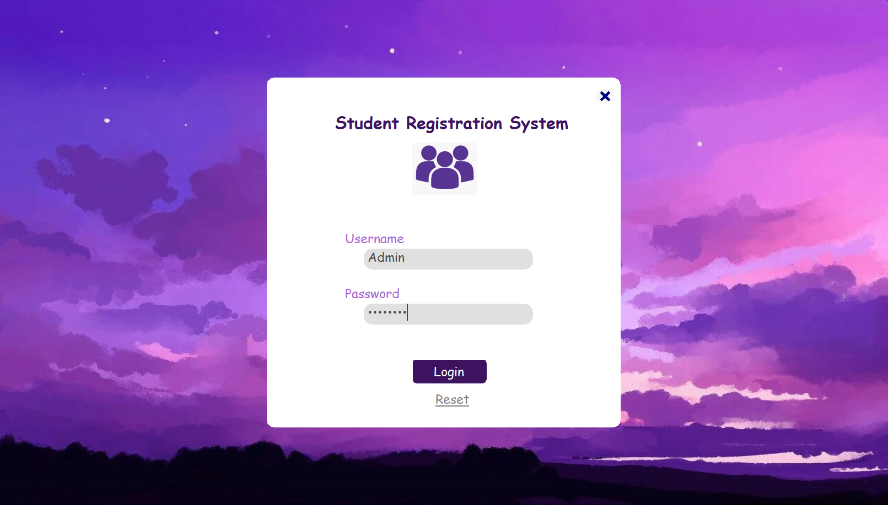
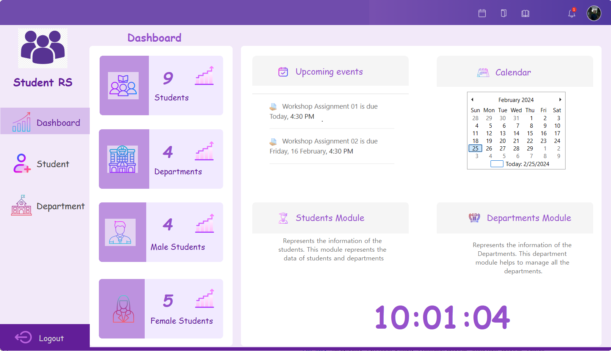
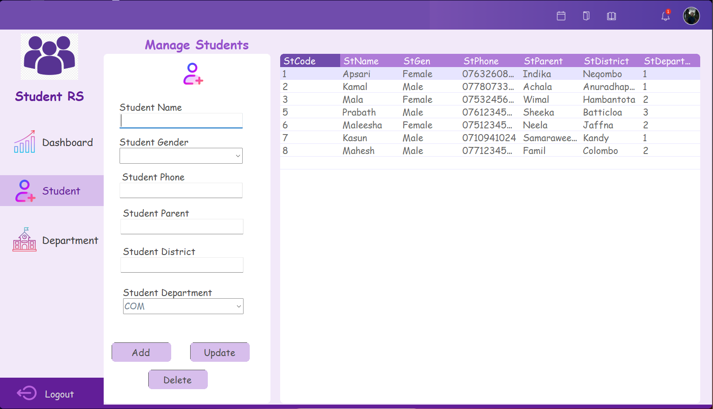
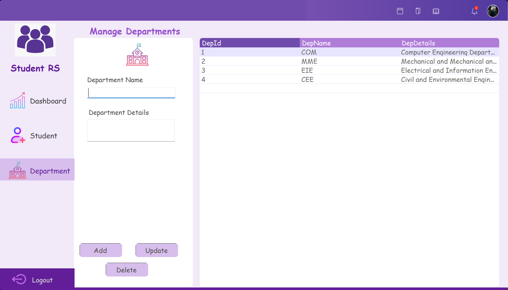

# Student_Registration_System

StudentHub: Empowering Educational Management with C# WinForms and MySQL 🎓
Welcome to StudentHub, your all-in-one solution for student administration! This vibrant C# WinForms project seamlessly integrates with a MySQL database to provide a dynamic and efficient platform for managing student records and departmental data.

Features:
🔐 Admin Authentication: Securely log in to the system with personalized admin credentials.

📚 Student Records Management: Effortlessly add, update, and delete student records, ensuring a comprehensive and up-to-date database.

🏢 Department Management: Dynamically handle departments with features to add, update, and delete, offering flexibility in adapting to evolving educational structures.

📊 Dashboard Insights: Get a quick overview of key metrics with an interactive dashboard. Instantly access the total number of students, departments, and a breakdown of male and female students.

🚀 Responsive UI with C# WinForms: Experience a smooth and intuitive interface designed with C# WinForms, providing a delightful user experience.

How to Use:
🔄 Clone the repository to your local machine.
🏗 Set up the MySQL database using the provided schema.
🔧 Open the project in Visual Studio, configure the database connection.
🚀 Build and run the application to unleash the power of StudentHub.
🤝 Contribute & Collaborate: We welcome contributions, bug reports, and suggestions to enhance StudentHub further. Let's make educational management a breeze together!

StudentHub is not just a project; it's a commitment to simplifying student administration. Dive into the code, explore the functionalities, and embark on a journey to transform educational management. Happy coding! 🚀✨

# Student_Registration_System

### Overview

## Login Preview

## Dashboard Preview

## Student Preview

## Departments Preview

## My process

### Built with

- C#
- Winforms
- Microsoft.NETCore.App
- Microsoft.WindowsDesktop.App
- MySQL

